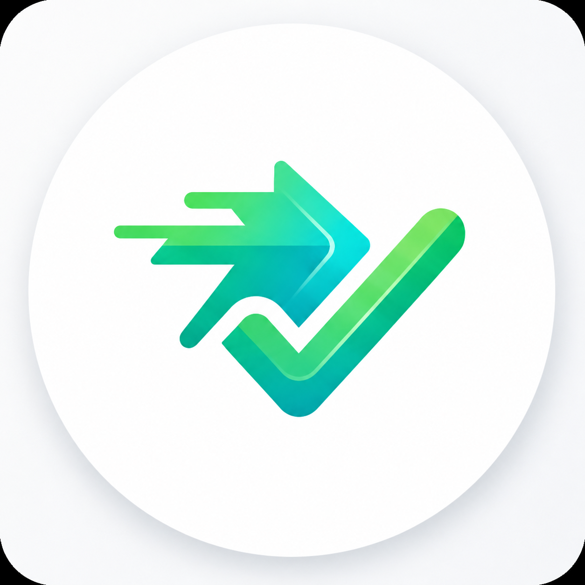

<div align="center">

# 🏎️ MOSPEE
### Premium Automotive Performance Tracking Platform 💨

<picture>
  
</picture>
<br><br>

[](https://kotlinlang.org/)
[](https://developer.android.com/jetpack/compose)
[](https://firebase.google.com/)
[](https://developer.android.com/training/data-storage/room)
[](https://osmdroid.github.io/)

**MOSPEE** is a state-of-the-art automotive telemetry platform engineered for precision, performance, and visual excellence. It delivers real-time GPS tracking, deep trip analytics, and seamless cloud synchronization within a premium “Dark Tech” experience.

</div>

---

## 📖 Project Overview

MOSPEE transforms raw GPS data into meaningful performance insights for drivers. Built with a Kotlin-first modern Android stack, it focuses on accuracy, reliability, and a high-end visual experience.

### Core Value Proposition
- **📡 Precision Telemetry**: High-accuracy GPS tracking with intelligent filtering
- **⚡ Real-Time Insights**: Live speed, distance, and route visualization
- **🔄 Hybrid Storage Engine**: Offline-first with seamless cloud sync
- **📊 Advanced Analytics**: Post-trip performance breakdowns
- **🎨 Premium UX**: Dark-tech inspired UI with high readability

---

## 🏗️ System Architecture

MOSPEE follows **Clean Architecture + MVVM**, ensuring modularity, scalability, and testability.

### 📱 Android App (Kotlin + Compose)
- Declarative UI using Jetpack Compose
- StateFlow + Coroutines for reactive data handling
- Custom UI components (speedometer, analytics cards)

### 🔄 Data Layer (Hybrid Engine)
- **Local Storage**: Room database for instant offline access
- **Remote Storage**: Firebase Firestore for cloud persistence
- **Sync Engine**: Background synchronization with startup recovery

### ⚙️ Background Processing
- Foreground Service ensures uninterrupted tracking
- GPS data processing with filtering and smoothing logic

---

## 📂 Project Structure

```text
MOSPEE/
├── app/src/main/kotlin/com/mospee/
│   ├── data/
│   │   ├── local/         # Room DB & Preferences (DataStore)
│   │   └── remote/        # Firebase & Firestore logic
│   ├── domain/
│   │   ├── model/         # Core Trip & Location models
│   │   └── usecase/       # Business logic (Start/Stop/Sync)
│   ├── service/           # Foreground GPS tracking service
│   ├── ui/
│   │   ├── components/    # Gauges, buttons, UI blocks
│   │   ├── navigation/    # Navigation graph
│   │   └── screens/       # Home, Trip, Summary, History
│   └── utils/             # Polyline, filters, formatters
```

---

## 🚀 Key Features

### 📡 High-Fidelity Tracking
- **Precision Telemetry**: Real-time speed, distance, and duration using high-accuracy location services
- **Background Resiliency**: Foreground Service ensures continuous tracking even when minimized or locked
- **Intelligent Noise Filtering**: Eliminates GPS jumps and unrealistic spikes for accurate metrics

### 📊 Performance Visualization
- **Kinetic Speedometer**: Custom gauge with smooth needle physics and high-contrast display
- **Dynamic Mapping**: Real-time route visualization using OSMdroid
- **Post-Trip Analytics**: Detailed summaries including:
  - Top speed
  - Average speed
  - Elevation data
  - Route replay

### 🔄 Hybrid Data Engine
- **Local-First Architecture**: Room caches last 10 trips for instant access
- **Cloud Sync**: Firestore stores long-term trip history
- **Polyline Compression**: Google Polyline Algorithm reduces path size by >90%
- **Startup Sync Engine**: Automatically syncs unsaved trips on launch

---

## 🎨 Design Philosophy: Premium Dark Tech

MOSPEE’s interface is inspired by modern automotive dashboards.

- **Contrast-First UI**
  - Background: `#0C0E14`
  - Accent Colors:
    - Racing Orange `#FF4D00`
    - Electric Green `#00E676`

- **Glanceable Metrics**
  - Bold typography (Inter Black)
  - Optimized for quick readability while driving

- **Tactile Experience**
  - Micro-interactions and smooth transitions
  - Responsive UI feedback

---

## 🚀 Technical Stack

| Layer | Component | Description |
|------|----------|------------|
| Language | Kotlin 2.0 | Coroutines + StateFlow |
| UI | Jetpack Compose | Declarative UI system |
| DI | Hilt | Dependency injection |
| Persistence | Room | Local database |
| Backend | Firebase | Firestore + Anonymous Auth |
| Maps | OSMdroid | Offline-capable maps |
| Location | Google Play Services | Fused Location Provider |

---

## ⚙️ Configuration & Setup

### 1. Firebase Setup
1. Go to Firebase Console
2. Create a project
3. Enable:
   - Anonymous Authentication
   - Cloud Firestore
4. Download `google-services.json`
5. Place inside:
```
/app
```

### 2. Development Environment
- Use **Android Studio Ladybug (2024.2.1)** or higher

### 3. Build Application
```bash
./gradlew assembleDebug
```

---

## 🔐 Permissions

MOSPEE requires the following permissions:

- `ACCESS_FINE_LOCATION` → GPS tracking
- `FOREGROUND_SERVICE` → Background tracking continuity
- `POST_NOTIFICATIONS` → Live trip notifications

---

## 🔒 Security & Reliability

- Local-first ensures no data loss without internet
- Background sync guarantees eventual consistency
- Optimized GPS filtering prevents corrupted metrics
- Efficient data compression reduces cloud costs

---

## 📦 Core Capabilities Summary

- Real-time GPS telemetry
- Offline-first trip storage
- Cloud synchronization
- Advanced trip analytics
- Custom speedometer UI
- Background tracking service

---

<div align="center">
  <p>Built with 🏎️ for Precision Driving</p>
  <p>Developed by <strong>Priyan</strong></p>
  <p>© 2026 MOSPEE Platform. All Rights Reserved.</p>
</div>
